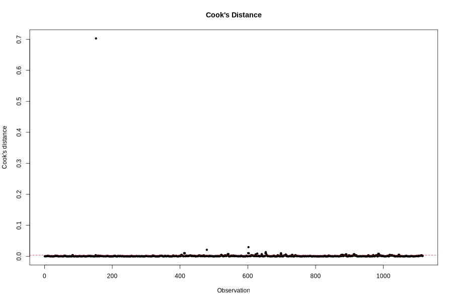
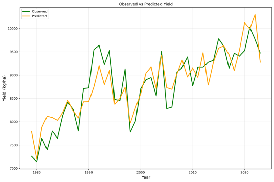
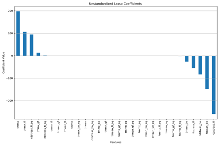
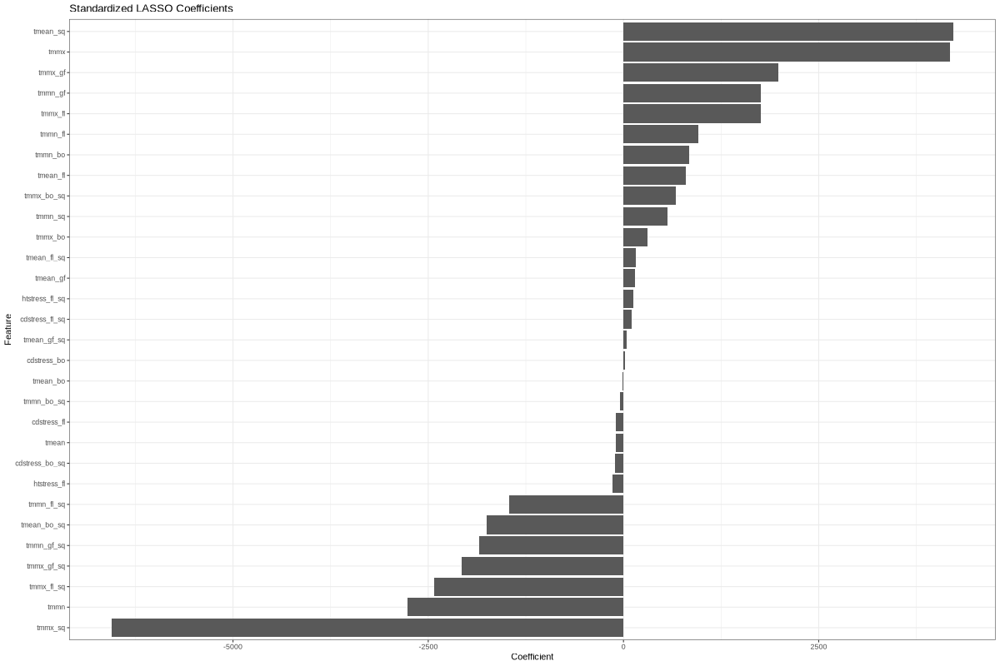

# Impact of Temperature Stress on Rice Yield in Sacramento Valley, California


## 1. Introduction

California has hot and dry summers with high amounts of solar radiation and relatively low pest pressure, contributing to the second-highest average yields in the world after Australia(Linquist et al., 2025). However, climate change is expected to negatively affect rice production in California due to increased temperatures and the occurrence of extreme weather events like droughts, heat stress, cold stress, etc.

Past research suggests that seasonal mean temperatures are the dominant drivers of yield losses in rice. Peng et al. (2004) suggested around 10% yield decline per C increase in night temperature. However, Espe et al. (2017) found that rather than seasonal warming, temperatures during the critical stages of rice explain most yield variability. In their study, they estimated only a 1-2% yield loss per C seasonal mean temperature, but the temperatures
stresses during critical reproductive stages had five times greater impact than seasonal warming. Similar results have been found in other subtropical rice systems Zhang et al. (2014). Espe et al. (2017) showed that the largest temperature-driven effect on yield was found to be cool stress during the booting stage, followed by cold stress during flowering, heat stress during flowering, seasonal mean Tmmx, seasonal mean Tmmn, grain-fill stage mean Tmmx and grain-fill stage mean Tmmn.

However, these findings have not yet been tested at a broader scale, such as county level
analyses. While the field experiments by Espe et al. (2017) have established the relationship between temperature variables on rice yield, how these processes pan out in real-world farming systems, with variable management practices and spatially heterogeneous climate conditions needs to be understood. This research will address the knowledge gap with below mentioned research objective
 - Evaluate how the seven stress parameters unique to different rice growing stages explain yield variability in California’s Sacramento Valley using historical climate and yield data


## 2. Data and Methods

### 2.1 County Level Yield Data in California

The rice yields are from the United States Department of Agriculture (USDA) National Agricultural Statistics Service (NASS) which provides county-level crop statistics from 1980 to present. In California, rice is grown in 9 countries in Sacramento Valley: Glenn, Butte, Colusa, Yuba, Sutter, Placer, Yolo, Sacramento and San Joaquin

### 2.2 Climate Data

The climate data are obtained from high-resolution gridded dataset called gridMET which provides climate variables at a spatial resolution of 4km covering the contiguous United States from 1979 to present. 

### 2.3 Rice Cropland Layer

We use the Cropland Data Layer (CDL) which is a 30m resolution raster dataset with geographical locations of croplands in contiguous US. We use this dataset to identify the rice growing grid cells and calculate county-level average climate indices.  

### 2.4 Rice Phenology 

Rice growth stages are identified using Growing Degree Days Model, which has been tested to be accurate for California Rice System. Using GDD model, rice growth stages such as Booting, Flowering and Grainfill are determined. 

### 2.5 Temperature Indices (TI)

Temperature and Stress Indices are calculated for the three rice growth stages and for entire growth season. The following are the temperature variables and their naming convention

|Stages / Variables | Booting | Flowering | Grainfill | Growth Period |
|--------------------|---------|-----------|-----------|---------------|
| Minimum Temperature | tmmn_bo | tmmn_fl | tmmn_gf | tmmn |
| Maximum Temperature | tmmx_bo | tmmx_fl | tmmx_gf | tmmx |
| Mean Temperature | tmean_bo | tmean_fl | tmean_gf | tmean |
| Cold Stress | cdstress_bo |  |  |  |
| Heat Stress | htstress_bo | htstress_fl |  |  |


### 2.6 Statistical Modeling

We used a lasso regression model for our analysis because lasso regression can mitigate the problem of multicollinearity in our variables (Wu et al., 2025).We removed the outliers and extreme values using cook’s distance. We trained a total of 100 models over the period of 1979 to 2023 by selecting a subset of 70% of observational data and evaluating on the remaining 30%. The lasso regression model is as shown below: 
    
 ```math
Y_c(t) = F_c + \gamma_c t
+ \sum_{i=1}^{N}
\left[
\alpha \, TI_c^i(t) + \beta \, TI_c^i(t)^2
\right]
+ \varepsilon_c(t)
```

where subscripts $c$, $i$, and $t$ indicate county, temperature indices, and year, respectively.  
$Y_c(t)$ is the rice yield for county $c$ in year $t$.  
$F_c$ refers to county-level fixed effects representing average yield differences between counties.  
$\gamma_c t$ represents county-level temporal trends not explained by climate variations.  
$\alpha$ and $\beta$ are the linear and quadratic coefficients, respectively.  
$\varepsilon_c(t)$ is the error term.

## 3. Results and Discussion

### 3.1 Model Results

An evaluation of the statistical models over the historical period driven by the gridMET observed climate (Figure 1, panel a) shows high coefficients of determination (R2) for both the training set (median R2 = 0.79) and the testing set (median R2 = 0.69) and the ability to reproduce the trends and the year-to-year fluctuations in rice yields, thus demonstrating the robust performance of the statistical modeling approach. The code used to run the analysis in R can be found in the supplementary files. 

#### 1.a   
                                         


#### 1.b 



*Figure 1: Evaluation of statistical models. Coefficients of determination (R2) btained from training datasets (70%) and testing dataset (30%) for the 1,000 statistical models are shown in 1.a.  1.b displays the California average yield time series simulated by the 1,000 statistical models driven by GridMet climate data over the historical period (1980-2020).*


### 3.2 Temperature variables contribution to yield change

Lasso model performed regularization and variable selection. Based on the lasso model coefficients, the most influential predictors of rice yield include both temperature and stress-based variables, particularly during the flowering and booting stages. Positive coefficients such as tmmx, tmmx_fl tmmx_gf suggest that moderate warm conditions during the growth stages are associated with increased yields. Large negative coefficients such as htstress_fl, cdstress_bo indicate substantial yield penalties under heat stress during flowering and cold stress during booting. These results are in line with the findings from Espe et al. (2017). Only linear relationship was considered by Espe et al. (2017) but in our model the presence of squared terms among the strongest predictors highlights non-linear climate sensitivity, where yield declines rapidly beyond stress thresholds. These results emphasize flowering and booting as critical windows of climate vulnerability for rice production. 



*Figure 2: Temperature variables contributions to yield change*

## References

Espe, M. B., Hill, J. E., Hijmans, R. J., McKenzie, K., Mutters, R., Espino, L. A., Leinfelder‐Miles, M., Van Kessel, C., & Linquist, B. A. (2017). Point stresses during reproductive stage rather than warming seasonal temperature determine yield in temperate rice. Global Change Biology, 23(10), 4386–4395. https://doi.org/10.1111/gcb.13719

 Linquist, B., Al-Khatib, K., Brim-DeForest, W., Espe, M. B., Espino, L., Leinfelder-Miles, M., & Stogsdill, J. R. (2025). Predictors of high rice yields in a high-yielding environment: Lessons from a yield contest. Field Crops Research, 322, 109693. https://doi.org/10.1016/j.fcr.2024.109693

Peng, S., Huang, J., Sheehy, J. E., Laza, R. C., Visperas, R. M., Zhong, X., Centeno, G. S., Khush, G. S., & Cassman, K. G. (2004). Rice yields decline with higher night temperature from global warming. Proceedings of the National Academy of Sciences, 101(27), 9971–9975. https://doi.org/10.1073/pnas.0403720101
    
Wu, S., Zikalala, P. G., Alba, S., Jarvis-Shean, K. S., Kisekka, I., Segaran, M., Snyder, R., & Monier, E. (2025). Advancing the Modeling of Future Climate and Innovation Impacts on Perennial Crops to Support Adaptation: A Case Study of California Almonds. Earth’s Future, 13(4), e2024EF005033. https://doi.org/10.1029/2024EF005033
    
Zhang, Z., Wang, P., Chen, Y., Song, X., Wei, X., & Shi, P. (2014). Global warming over 1960–2009 did increase heat stress and reduce cold stress in the major rice-planting areas across China. European Journal of Agronomy, 59, 49–56. https://doi.org/10.1016/j.eja.2014.05.008


# Supplementary Files

## Contents of this file 

### I.	Introduction 
### II.	Figures S1 to S2 
### III.	R script

### I.	Introduction 
The supporting information provides additional detail on Cook’s Distance for outlier removal (Figure S1) and the standardized lasso coefficients (Figure S2). R script used to run the model is at the end of the document. 

 
#### Figure S1


 
#### Figure S2


